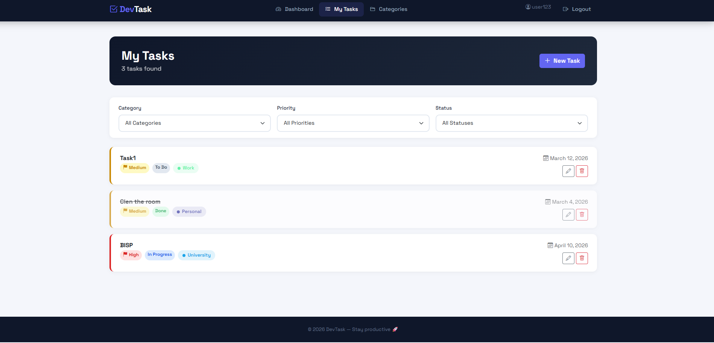

# DevTask - Task Management System

A full-stack task management web application built with Django, PostgreSQL, Docker, and Nginx.

## Features
- User registration, login and logout
- Create, edit, delete and view tasks
- Set task priority (Low, Medium, High)
- Track task status (To Do, In Progress, Done)
- Organize tasks by categories with color coding
- Filter tasks by category, priority and status
- Dashboard with task statistics and progress bar
- Fully containerized with Docker

## Technologies
- **Backend:** Django 4.2, Python 3.11
- **Database:** PostgreSQL 15
- **Web Server:** Nginx + Gunicorn
- **Containerization:** Docker, Docker Compose
- **Frontend:** Bootstrap 5, Bootstrap Icons
- **Testing:** pytest-django
- **CI/CD:** GitHub Actions

## Local Setup

### Prerequisites
- Docker Desktop installed
- Git installed

### Steps
1. Clone the repository:
```
   git clone https://github.com/00016014/00016014_DSCC_CW1.git
   cd 00016014_DSCC_CW1
```

2. Create `.env` file in project root:
```
   SECRET_KEY=your-secret-key-here
   DEBUG=False
   ALLOWED_HOSTS=localhost,127.0.0.1
   DB_NAME=mydb
   DB_USER=myuser
   DB_PASSWORD=mypassword
   DB_HOST=db
   DB_PORT=5432
```

3. Build and run with Docker:
```
   docker compose up --build
```

4. Run migrations:
```
   docker compose exec web python manage.py migrate
```

5. Create admin user:
```
   docker compose exec web python manage.py createsuperuser
```

6. Visit: http://localhost

## Deployment Instructions

1. SSH into your server
2. Clone the repository
3. Create `.env` file with production values
4. Run: `docker compose up -d --build`
5. Set up SSL with Let's Encrypt

## Environment Variables

| Variable | Description | Example |
|---|---|---|
| SECRET_KEY | Django secret key | django-insecure-xxx |
| DEBUG | Debug mode | False |
| ALLOWED_HOSTS | Allowed hostnames | localhost,yourdomain.com |
| DB_NAME | Database name | mydb |
| DB_USER | Database username | myuser |
| DB_PASSWORD | Database password | mypassword |
| DB_HOST | Database host | db |
| DB_PORT | Database port | 5432 |

## Running Tests
```
docker compose exec web pytest
```

## Project Structure
```
├── config/          # Django project settings
├── core/            # Main application
│   ├── templates/   # HTML templates
│   ├── models.py    # Database models
│   ├── views.py     # View functions
│   ├── urls.py      # URL routing

│   └── tests.py     # Unit tests
├── nginx/           # Nginx configuration
├── Dockerfile       # Multi-stage Docker build
├── docker-compose.yml
└── requirements.txt
```

## Screenshots



